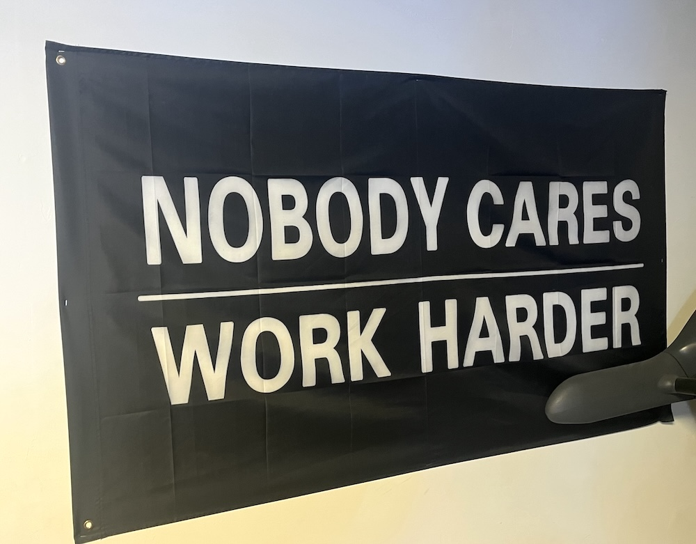

I should get paid for being this majestic.

```
As I queue here at the bank,
my mind goes roaming like the tank
that, stolen, rampaged San Diego,
mashed some cars like baked potatos,
knocked down poles and fire hydrants,
back in 1995.

The thief, they said a jobless plumber,
grabbed the craft and pulled a runner
down the streets on top of traffic,
smashing, crashing, wreaking havoc,
to run amok ignoring sirens
on the last day of his life.

So, anyway, I stand and wait,
and as I do I contemplate
the lives of folks and all their capers
that get their names in all the papers.

And with my musings here in line,
it seems to me that Michael Jackson
dangling his baby Blanket
from the balcony on four
did not ever stop to think
about all of the media stink
at little Jr on the brink
of reaching abruptly the floor.
```

`<end>`

```
I sit here eating a burrito,
wondering why it looks pink.
My stomach churns, I feel uneasy.
Suddenly extremely queasy,
I barely make it, not so easy,
to throw it all up in the sink.
```

`<end>`

```
Two monkeys dance a wild tango
'round the jungle, hither yon,
together faster than they can go
alone through the Amazon.
They crash right through some prickly bushes,
gallup off a precipice.
Sprawling, falling, cold wind rushes
in their ears, all hope is gone.
They should have looked where they were going,
but the monkeys won't be missed.
```

`<end>`

```
It's late! Go to sleep! My inner voice cries.
Put pillow to head! Close lids over eyes!
If you don't get down, you'll never get up!
You need to sleep NOW, so don't make a fuss!
You know that I'm right, and I am just you!
So what I am saying is what you must do!
Stop! Sleep! Put that down! Quit browsing the news!
Your laptop and phone blast your eyes with blue hues!
I read that that's bad, which means you did too!
So hit the lights and blank the screen.
It's time to lose yourself in dream.
```

`<end>`

https://en.wikipedia.org/wiki/Nonet

```
9. A farmer works for years in the fields
8. by carthorse hooves and steel plough wheels
7. grinding ground to greater yields
6. from birth until she keels.
5. To market she wields
4. with "Farm Fresh" seals
3. veg unpeeled.
2. Who'll deal?
1. We'll.
```

`<end>`

```
Plant a pickle, grew a pickle, take a pickle, owe a pickle.
Eat a pickle, slurp a pickle, smoke a pickle, blow a pickle.
Slice a pickle on the table with a scalpel, surgeon's practice.
Put a pickle in a pot of sandy soil, prickless cactus.
Whisper secrets to a pickle, cold and green and wetly glistening.
Pickle doesn't care what you said, not so very good at listening.
```

`<end>`

```
It's weird, you know, to feel so close.
How does this make any sense?
We've only met just now, and yet,
the conversation's immense.

We talk and talk and talk some more,
I never get tired, you never get bored.
Two hours go by, then three, then four.
It never feels like fulfilling a chore.

I'll be sad when it's in the past tense.
```

`<end>`

```
Summer fling with a beautiful woman--
talking 'til dawn, borrowed kisses, park benches, holding hands.

This mustn't last long, says the beautiful woman.
We cannot go on, says the beautiful woman.
It's terribly wrong, says the beautiful woman.

My man's coming home, says the beautiful woman,
and there's a good chance that he won't understand.
```

`<end>`

```
I found a dirty dollar on the ground.
I guess it's kinda fortunate that I was looking down.
It's not enough to buy a coffee now,
but every one I find just gets me closer to the line
of lifting up the weight that bends my crown.
A tiny bit, but still it counts somehow?
This ragged bill, with little grace, unexpectedly misplaced,
abandoned on its grimy face and sitting in this filthy space,
until I find it, pick it, pocket,
transport, carry, escort, walk it
home to wash it, dry it, lay it...
And one day soon I'll spend or pay it.
```

`<end>`

```
Three coins catch the corner of my eye.
Quarter, quarter, dime, how'd you get there little guys?
Shining shyly from a pile of leaves,
tucked into a crevice underneath a shady tree.

Maybe someone put you there to grow?
"Money grows on trees" is how I think the saying goes?
Or is that backwards? I don't really know.
Maybe they're a secret stash forgotten long ago?
Or if the tree was trusted, it could hold them in escrow?

I think they look like they've been here some time.
And I say now you're mine, little quarters, little dime.
I'll pocket you and walk with you and clean off all your grime.
It's rescuing, not stealing. Surely that's no glaring crime.

And when I go out roaming next I'm sure I'll see a sign.
That all the time I spent with you was good use of my feet.
Like at the coffee shop there is a tip jar by the line.
And that's a better endpoint than the street.
```

`<end>`

```
Happy Birthday, so they say!
You woke up! It's a brand new day!
The sunlight glows through gauzy curtains.
The day ahead's not set for certain!
Good morning! Good morning!
An expression of joy.
The universe beckons!
Get moving, cowboy!
Your friends have been waiting!
There's life to be done!
Memory creating!
Enjoying each one!
When greeting, when leaving,
in morning, in evening,
not timely, just feelings
about seeing someone.
Good morning. Good morning.
Happy birthday.
```

`<end>`


```
I don't know Brandy Melville,
but her tote bag cards are stacked.
Or maybe it's some St George ads,
and Brandy's on the back.
Or maybe they're a lover's mark--
Brandy plus Melville, true amour.
Left in the fence around a park
to tell you of their favorite store.
```

`<end>`


```
Ikea wardrobe, pulled apart,
and laid against the wall as art.
It occupies visual space,
a white particle board showcase.

Soon I'll sell it to a buyer,
or maybe give if need is dire.

Oops, a piece broke. I glued the crack.
They'll never know. It's in the back. :)
```

<br clear="right"/>

`<end>`



```
A sign in my gym all the way at the back
with solid white writing and background in black,
alongside the bikes and mechanical stairs,
in very large lettering "Nobody Cares".

Encouraging language to keep you on track,
a mantra of power, "Go! Firmly attack!
It isn't enough to just plan your day smarter!
You're here to be stronger, so push and Work Harder".
```

<br clear="right"/>

`<end>`


```
Please fly here post haste with your hydrant applier!
A spark has ignited in my lint-clogged dryer!
Don air tanks and facemasks to safely respire,
and helmets and jackets, protective attire!
Don't dawdle, oh, come quick, before they expire!
You must save my pets, 'cuz the house is on fire!
```

`<end>`